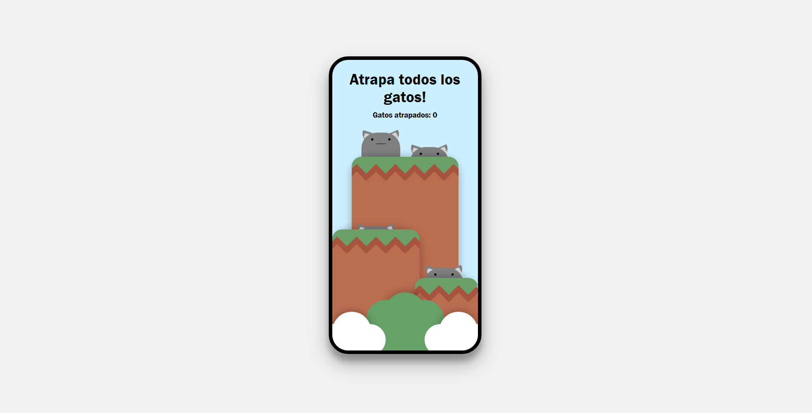

# MULTI STEP FORM

## Tabla de contenidos

- [Descripcion](#descripcion)
  - [Screenshot](#screenshot)
  - [Links](#links)
  - [Hecho con](#hecho-con)
- [Autor](#autor)

## Descripcion

Sencillo mini juego para atrapar los gatos! Construido unicamente usando HTML y CSS como ejercicio para practicar animaciones en CSS.

## Screenshot

## Links

- Repositorio: [GITHUB](https://github.com/J-HernandezM/catch-cats)
- Live site: [PAGES](https://j-hernandezm.github.io/catch-cats/)

## Hecho con

- HTML
- CSS Animations

## Autor

- Website - [Portfolio en construccion](https://j-hernandezm.github.io)
- Github - [@J-HernandezM](https://github.com/J-HernandezM)
- Twitter - [@__HernandezM](https://www.twitter.com/__HernandezM)